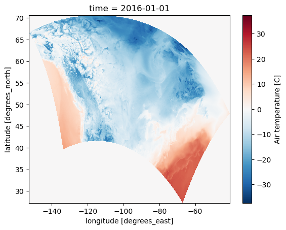

# eccc-extract-hrdps
Extract from the fst HRDPS to NetCDF files and:
- converts from the rotated grid to EPSG:4326
- corrects the UU and VV windcomponents for this rotation
- outputs [meteorological wind direction](https://mst.nerc.ac.uk/wind_vect_convs.html) (direction from) and windspeed
- changes to 1D lat/lon CF compliant latitude and longitude
- variables to CF-compliant names, and adds all attributes
- deaccumulates the precipitation to correspond to the upcomming integration period. E.g., 01:00 corresponds to the precip for 01:00 - 02:00 period
- computes RH
- outputs daily netcdf files


## Usage

The jupter notebook builds the job chunks and submits the HPC jobs.

`convert.py` contains the main conversion logic 

```
import xarray as xr
xr.open_mfdataset('hrdps_2016-2023_daily/20160101.nc').isel(time=0).TT.plot()
```



## Libraries
Requires the fst reader:

```
 . ssmuse-sh -p /fs/ssm/eccc/cmd/cmds/env/python/cmds_python_latest
```
or
https://github.com/sebastiendfortier/conda_packaging